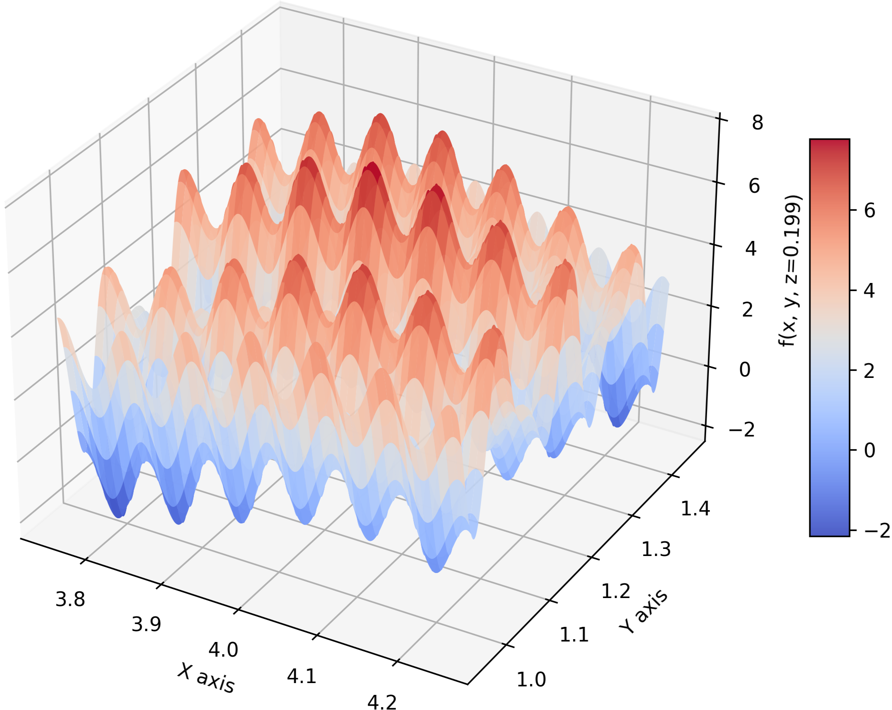
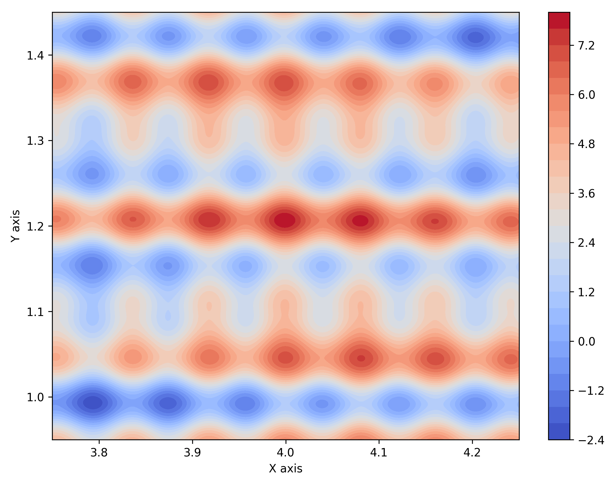
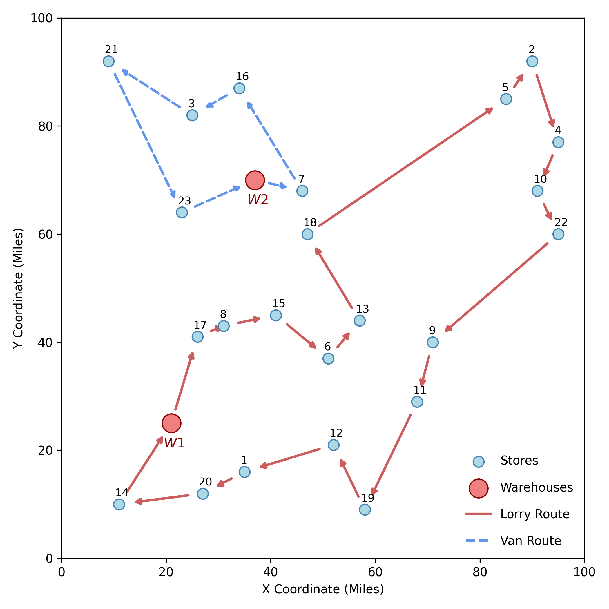
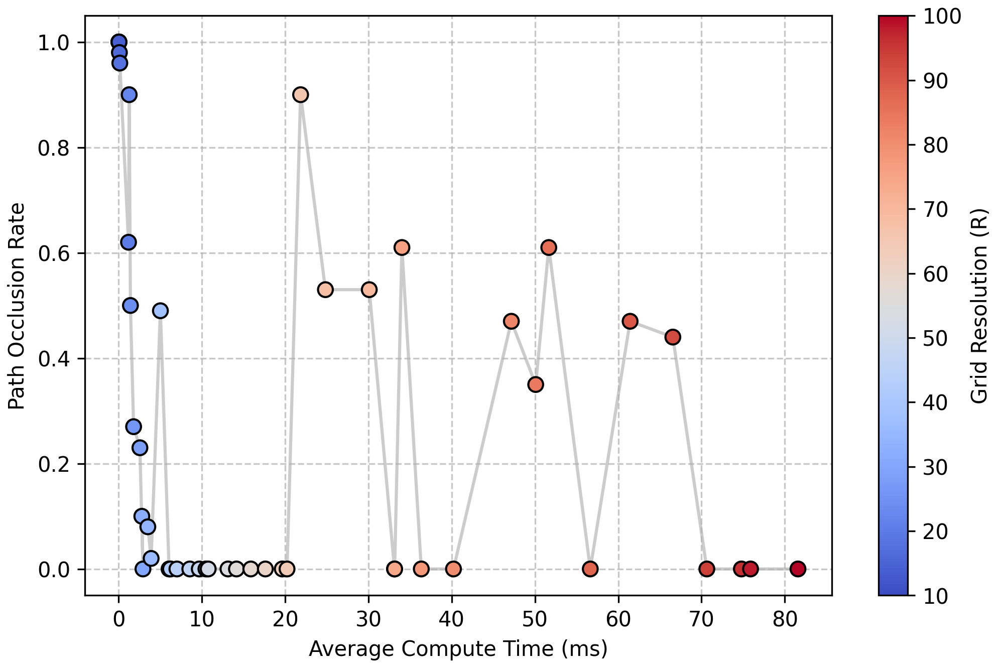
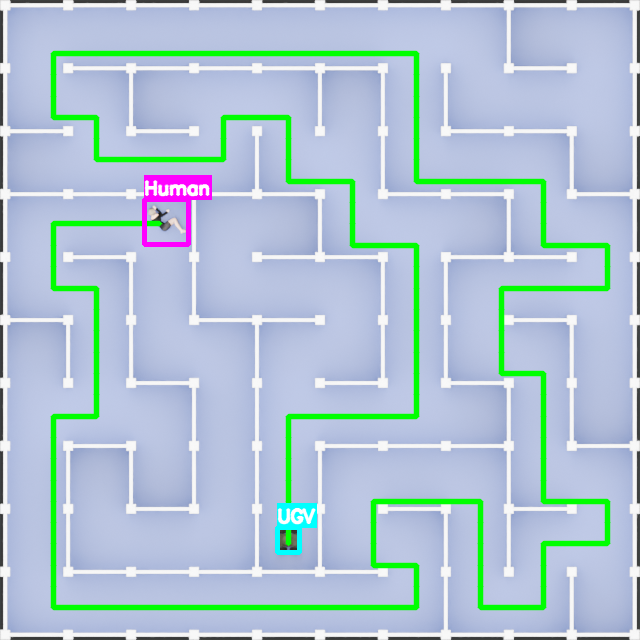

# MATPMD4: Applied Optimisation Algorithms

> **📄 Read the full academic report:** [MATPMD4_Assignment2](docs/MATPMD4_Assignment2_3539054.pdf)

This repository contains the code, datasets, and visualizations for a three-part applied optimization project. It applies stochastic metaheuristic algorithms to solve complex, highly constrained engineering and logistics problems.

Because standard algorithms struggle with complex problems, this system navigates unpredictable data using **Evolution Strategies**, **Ant Colony Optimisation**, and **Simulated Annealing**.

 

## Part 1: 4D Global Optimization (Evolution Strategy)

* **The Challenge:** Finding the global maximum in a complex 4D landscape where standard algorithms get stuck on "false peaks."

* **The Solution:** A $(\mu + \lambda)$ Evolution Strategy. This method balances small, local adjustments with large, random leaps to bypass false peaks and reliably locate the true optimal coordinates.

 

  
  &nbsp;
  

Figure 1: Visualisations of the objective function's fitness landscape at the fixed slice $z = 0.199$. The view is zoomed in at $3.75 \leq x \leq 4.25$ and $0.95 \leq y \leq 1.45$

 

## Part 2: Supermarket Distribution Network (Ant Colony Optimisation)

* **The Challenge:** Finding the lowest-cost delivery routes for a mixed fleet of vehicles delivering from two warehouses to 23 stores. Standard algorithms struggle with strict capacity limits and often generate broken, invalid routes.

* **The Solution:** Ant Colony Optimisation (ACO). Instead of guessing and fixing routes retroactively, algorithmic "ants" build valid paths step-by-step using virtual trails. This method naturally enforces vehicle capacities and automatically untangles crossed paths to create highly efficient networks.

 

  

Figure 2: The optimised distribution network. Directional paths denote the $18$-store Lorry route (red) from Warehouse $1$ and the $5$-store Van route (blue) from Warehouse $2$.

 

## Part 3: Ariadne Grid Optimization (Simulated Annealing)

* **The Challenge:** Finding the optimal map grid resolution for an autonomous vehicle. If the grid resolution is too low, the system misreads open pathways as solid walls. If the resolution is too high, the calculated path clips into corners and processing times become severely delayed.

* **The Solution:** Simulated Annealing (SA). This algorithm balances calculation speed against navigation failures to discover a stable "safe zone." It successfully identifies a precise grid resolution that guarantees zero wall collisions while maintaining fast, real-time processing speeds (~10ms).

 

  

Figure 3: A comparison showing the trade-off between computation time and path occlusion. The colour gradient $(\Delta R)$ illustrates the system's unpredictable performance, particularly the tendency for high-resolution setups to cluster into failure states.

 

  

 

Figure 4: Visual output of the Ariadne system. The aerial image is translated into a matrix, allowing the $A^*$ algorithm to generate an optimal trajectory (green) while avoiding structural boundaries (white).
